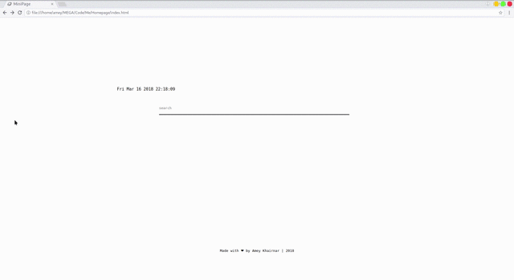
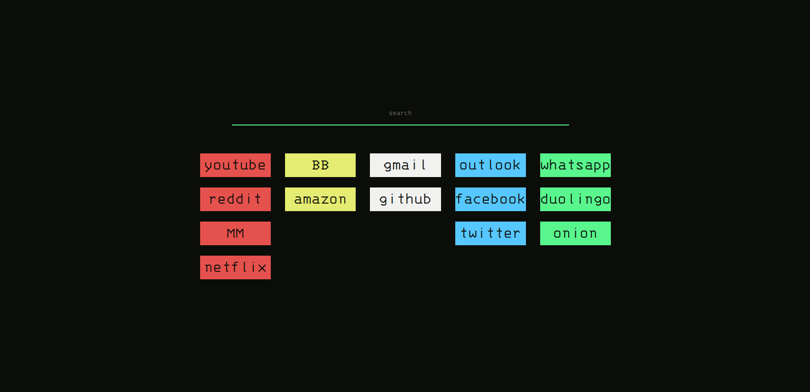
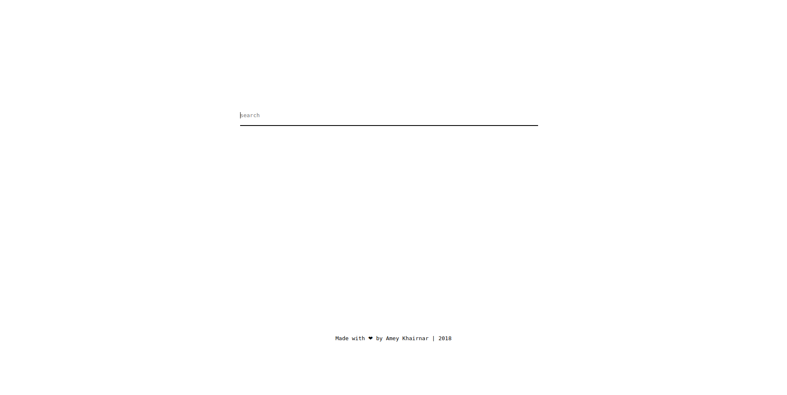
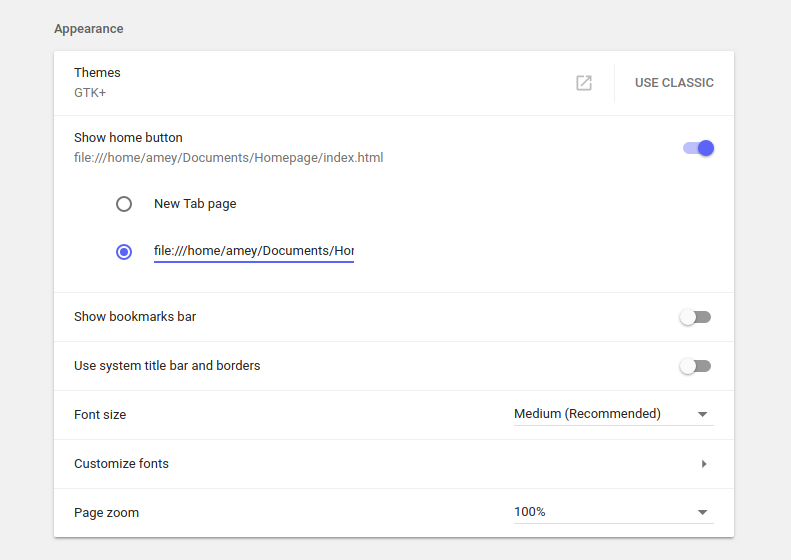
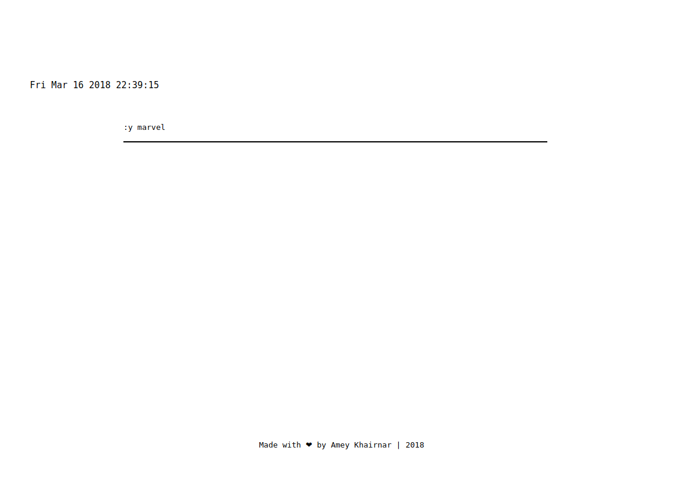
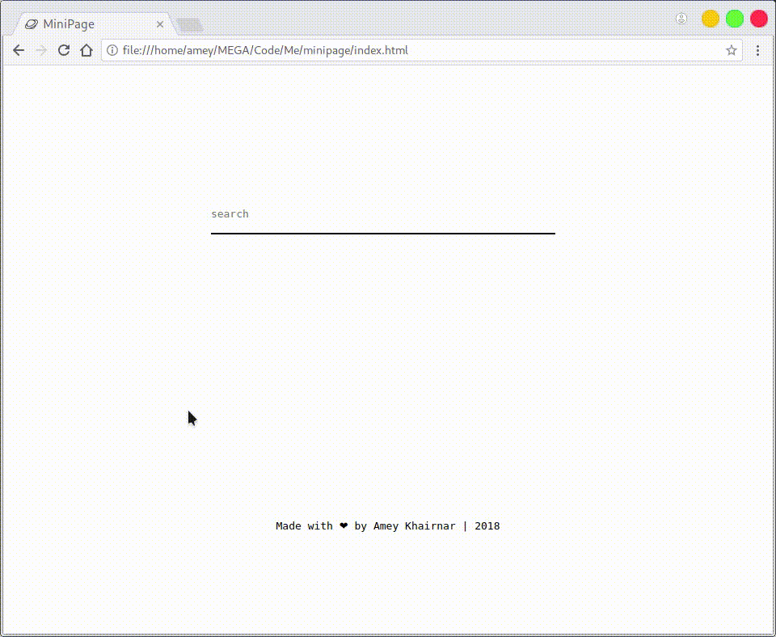
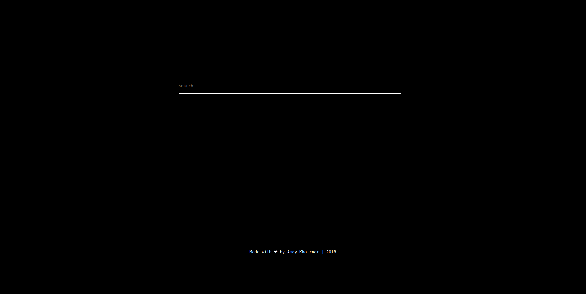
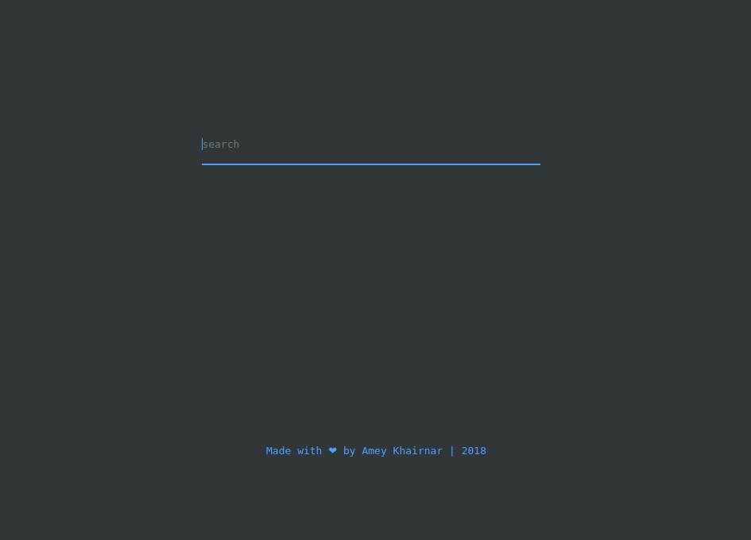

# MiniPage

Minimalistic Home Page for your browser, operated using keyboard.



This is the new design(made to go with my tetris i3 rice):

Everything regarding how it works is still the same, execpt the visual shortcuts this time.

Old design:
<kbd>  </kbd>


### Installation

Download MiniPage to your prefered location, and set the homepage value to the path to 'index.html'

```
git clone https://github.com/ameyrk99/minipage.git
```



### Ways to navigate:

* Search:



Search over web by: ':g xyz' or':b xyz'(where xyz is your search term) where: 

	:g for Google
	:b for Bing
	:d for DuckDuckGo
	:w for Wikipedia
	:y for youtube
	:r for reddit
	:ya for yahoo
	:t for twitter
(Default being Google i.e if you don't type anything before the search term, it'll google it). Change it if you want on line 54.

Add more cases, if you want, from line 44.

* Direct link:
just type or paste a link like youtube.com, etc and hit enter.


* Keyword redirect:
Enter a keyword such as 

	facebook
	gmail



Add your keywords and their url to srchEn array in js/search.js


Change the colors from css/style.css if you'd like :)

<kbd>  </kbd>

<kbd>  </kbd>


Note: The clock is not enabled by default. Uncomment the p(id: dateTime) in index.html and function below comment 'dateTime' in search.js
